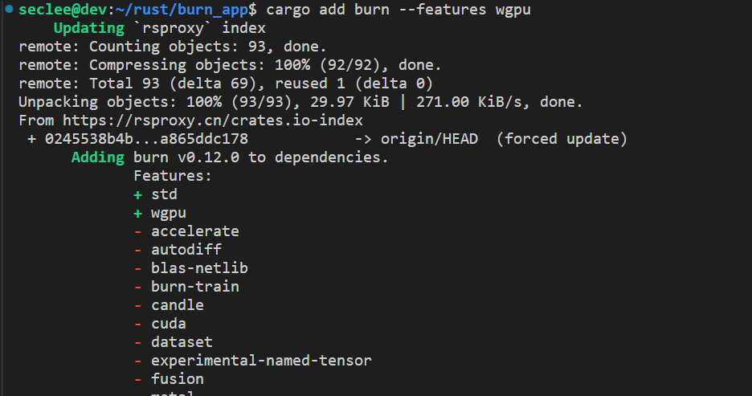
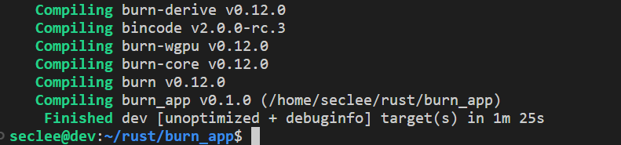
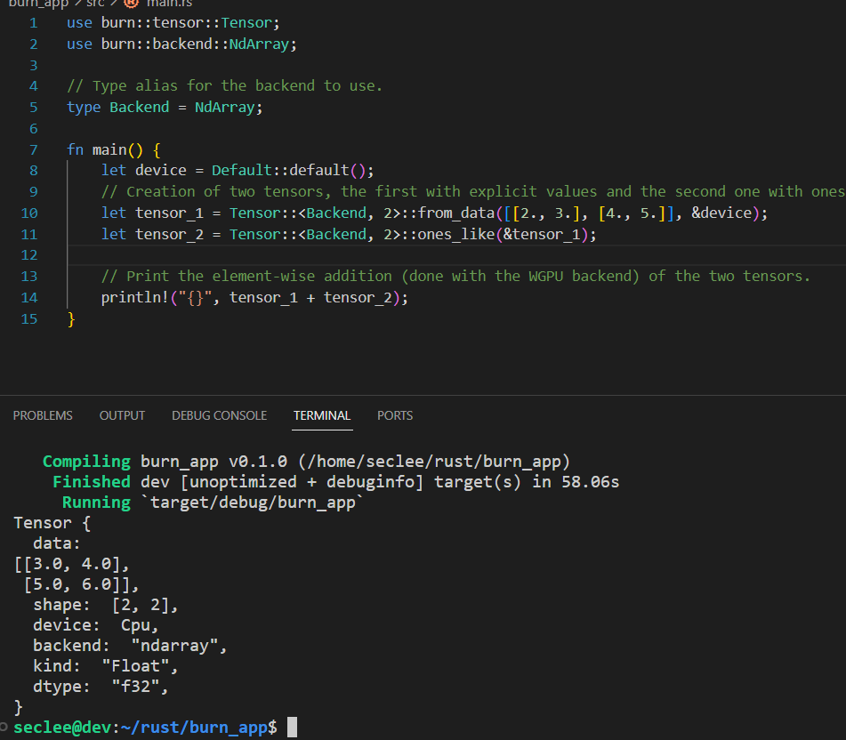
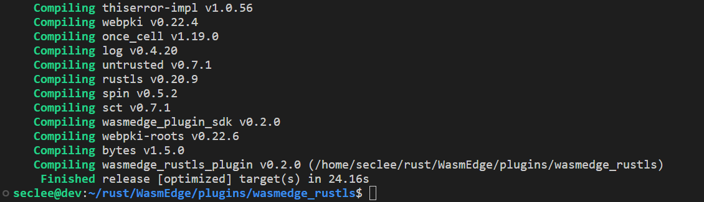
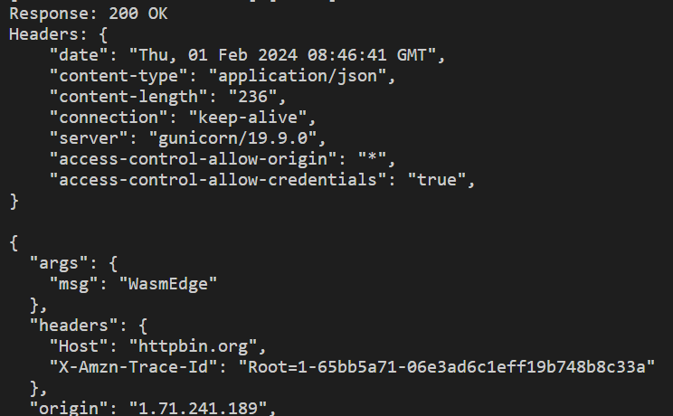
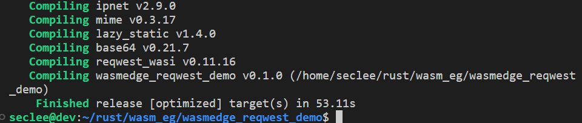
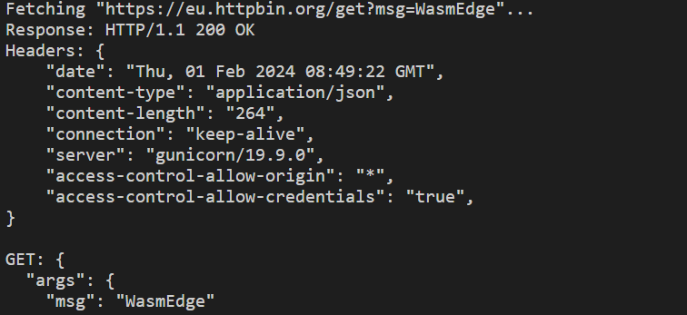

# Env prepare
install rust env
```
sudo apt install -y curl wget vim build-essential

# using rustup
curl --proto '=https' --tlsv1.2 -sSf https://sh.rustup.rs | sh

## change sources
https://blog.csdn.net/qq_28550263/article/details/130758057
```

# 1. Burn pretest
```
cargo new burn_app

cd burn_app/

// cargo add burn --features wgpu
// I choose ndarry as backend
cargo add burn --features ndarray
```




**write a simple app using burn**
```
cargo run
```


# 3. rustls build and test
Build success on my local virtualbox ubuntu 22.04

```
## install cmake 
sudo apt  install cmake

## install wasmedge first to avoid mistakes
curl -sSf https://raw.githubusercontent.com/WasmEdge/WasmEdge/master/utils/install.sh | bash
source $HOME/.wasmedge/env

## clone wasmedge
git clone https://github.com/WasmEdge/WasmEdge.git

## navigate to rustls
cd WasmEdge/plugins/wasmedge_rustls

## build plugin
cargo build --release
```


```
cp libwasmedge_rustls.so  ~/.wasmedge/plugin/
```

#### rustls test
```
# install wasm32-wasi
rustup target add wasm32-wasi
```

##### test 1 : The hyper API https client
```
git clone https://github.com/WasmEdge/wasmedge_hyper_demo

// Build
cd wasmedge_hyper_demo/client-https
cargo build --target wasm32-wasi --release
wasmedge compile target/wasm32-wasi/release/wasmedge_hyper_client_https.wasm wasmedge_hyper_client_https.wasm

// Run
wasmedge wasmedge_hyper_client_https.wasm
```



##### test 2 : wasmedge_reqwest_demo https client
```
git clone https://github.com/WasmEdge/wasmedge_reqwest_demo
cd wasmedge_reqwest_demo

# Build the Rust code
cargo build --target wasm32-wasi --release
# Use the AoT compiler to get better performance
wasmedge compile target/wasm32-wasi/release/https.wasm https.wasm

# Run the HTTPS GET and POST examples
wasmedge https.wasm
```



# 4. branch 
I have fork the branch 'hydai/0.13.5_ggml_lts' to https://github.com/derekwin/WasmEdge
