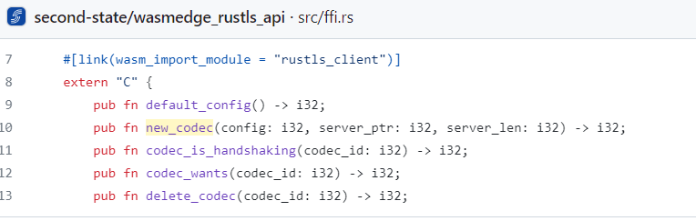
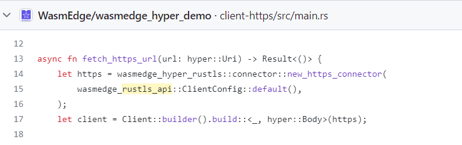
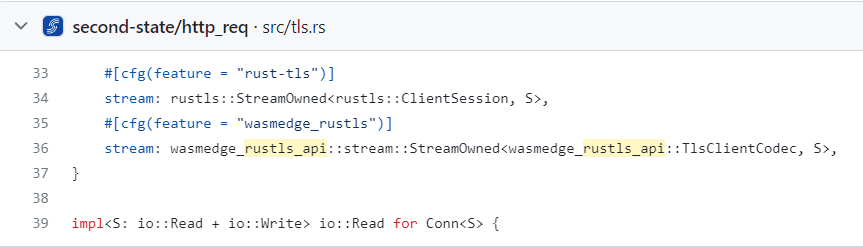
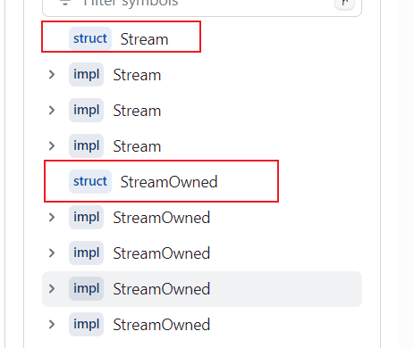
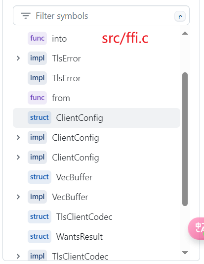

# LFX-Mentorship 2024-01 PreTest

- Env prepare
- Burn pretest
- Rustls build and test
    - Rutls build
    - Rustls testcases
- Git branch
- Analyzing the integration process of the wasmedge_rustls_plugin into WasmEdge
    - Structures of the plugin code
    - How the plugin is utilized
- What does the Burn project need to expose to WasmEdge? [todo]
- How does WasmEdge integrate and utilize Burn? [todo]

# Env prepare
install rust env
```
sudo apt install -y curl wget vim build-essential

# using rustup
curl --proto '=https' --tlsv1.2 -sSf https://sh.rustup.rs | sh

## change sources
https://blog.csdn.net/qq_28550263/article/details/130758057
```

# Burn pretest | mission 1
```
cargo new burn_app

cd burn_app/

// cargo add burn --features wgpu
// I choose ndarry as backend
cargo add burn --features ndarray
```


**write a simple app using burn**
```
cargo run
```


# Rustls build and test | mission 3
Build success on my local virtualbox ubuntu 22.04

```
## install cmake 
sudo apt  install cmake

## install wasmedge first to avoid the mistake [issues2303](https://github.com/WasmEdge/WasmEdge/issues/2303)
curl -sSf https://raw.githubusercontent.com/WasmEdge/WasmEdge/master/utils/install.sh | bash
source $HOME/.wasmedge/env

## clone wasmedge
git clone https://github.com/WasmEdge/WasmEdge.git

## navigate to rustls
cd WasmEdge/plugins/wasmedge_rustls

## build plugin
cargo build --release
```


```
cp libwasmedge_rustls.so  ~/.wasmedge/plugin/
```

#### Rustls test
```
# install wasm32-wasi
rustup target add wasm32-wasi
```

##### Test 1 : The hyper API https client
```
git clone https://github.com/WasmEdge/wasmedge_hyper_demo

// Build
cd wasmedge_hyper_demo/client-https
cargo build --target wasm32-wasi --release
wasmedge compile target/wasm32-wasi/release/wasmedge_hyper_client_https.wasm wasmedge_hyper_client_https.wasm

// Run
wasmedge wasmedge_hyper_client_https.wasm
```


##### Test 2 : wasmedge_reqwest_demo https client
```
git clone https://github.com/WasmEdge/wasmedge_reqwest_demo
cd wasmedge_reqwest_demo

# Build the Rust code
cargo build --target wasm32-wasi --release
# Use the AoT compiler to get better performance
wasmedge compile target/wasm32-wasi/release/https.wasm https.wasm

# Run the HTTPS GET and POST examples
wasmedge https.wasm
```


# Branch
I have fork the branch 'hydai/0.13.5_ggml_lts' to https://github.com/derekwin/WasmEdge

# Analyzing the integration process of the wasmedge_rustls_plugin into WasmEdge.
pull request : [pull/2762](https://github.com/WasmEdge/WasmEdge/pull/2762)

main change : [commit:163f](https://github.com/WasmEdge/WasmEdge/pull/2762/commits/163f00f7ae9c246e6dee95154f868babc1620e00)

### Structures of the plugin code
> | -> annotate 
```
# lib.rs

# error type define
enum TlsError
struct TlsIoState with a From trait | 根据另一种类型生成自己 | from rustls::IoState to TlsIoState

mod tls_client
    struct Ctx 
        rustls::ClientConfig
        ClientCodec
    struct ClientCodec | from rustls:ClientConnection

    mod | test_client_test | test_cts()

mod wasmedge_client_plugin
    default_config() | default_config
    new_client_codec() | closure | new_codec
    is_handshaking() | closure | codec_is_handshaking
    wants() | closure | codec_wants
    delete_codec() | closure | delete_codec
    process_new_packets() | closure | process_new_packets
    send_close_notify() | closure | send_close_notify
    write_raw() | closure | write_raw
    write_tls() | closure | write_tls
    read_raw() | closure | read_raw
    read_tls() | closure | read_tls
    create_module() | pub | PluginModule | add all fn ubove to module by .add_func()

wasaedge_plugin_sdk::plugin::register_plugin!() | register create_module() to .modules

```

### How the plugin is utilized


[wasmedge_rustls_api](https://github.com/second-state/wasmedge_rustls_api) is the api for this plugin, so that `hyper_wasi` can use rustls_plugin as tls.



Then the wasmedge_rustls_api be used as follows:





wasmedge_rustls_api/src/stream.c



wasmedge_rustls_api/src/ffi.c

